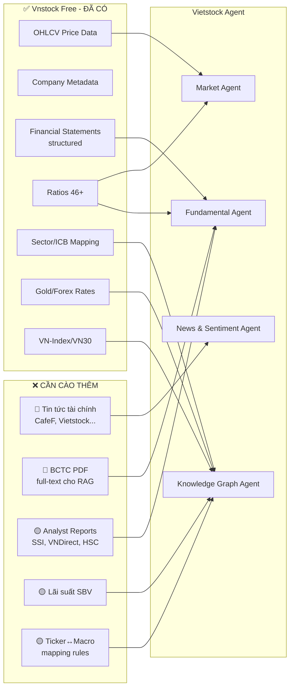

# Data Gap Analysis: Vnstock Free vs. Product Requirements

> So sánh dữ liệu miễn phí từ vnstock với yêu cầu của Vietstock Agent system

---

## Tóm tắt nhanh

| Bảng dữ liệu (04_DATA.md) | Vnstock Free đáp ứng? | Cần cào thêm? |
| :--- | :---: | :---: |
| `stock_price` (OHLCV) | ✅ Đủ | ❌ Không |
| `company_profile` | ⚠️ Thiếu một phần | ✅ Cần bổ sung |
| `financial_news` | ❌ Không có | ✅ **Cào toàn bộ** |
| `report_chunks` (RAG) | ❌ Không có | ✅ **Cào toàn bộ** |
| `indicator_cache` | ✅ Tự tính từ OHLCV | ❌ Không cần cào |
| `audit_log` | ✅ Tự sinh từ system | ❌ Không cần cào |

---

## Chi tiết từng bảng

### 1. `stock_price` — ✅ Đã đủ

| Field cần | Vnstock Free source | Status |
| :--- | :--- | :---: |
| `ticker` | `Quote.history()` → `time` column | ✅ |
| `date` | `Quote.history()` → `time` | ✅ |
| `open` | `Quote.history()` → `open` | ✅ |
| `high` | `Quote.history()` → `high` | ✅ |
| `low` | `Quote.history()` → `low` | ✅ |
| `close` | `Quote.history()` → `close` | ✅ |
| `volume` | `Quote.history()` → `volume` | ✅ |

**Kết luận:** Không cần cào thêm. Vnstock free `Quote.history()` (source KBS/VCI) cung cấp đủ OHLCV.

> [!TIP]
> Yêu cầu PRD: ≥ 2-3 năm dữ liệu (~1M+ rows cho ~1800 tickers). Vnstock free hỗ trợ.

---

### 2. `company_profile` — ⚠️ Thiếu một phần

| Field cần | Vnstock Free source | Status |
| :--- | :--- | :---: |
| `ticker` | `Company.overview()` → `ticker` | ✅ |
| `company_name` | `Company.overview()` → `company_name` | ✅ |
| `sector` | `Listing.all_symbols()` → `industry` | ⚠️ Chỉ có `industry`, không có `sector` riêng |
| `industry` | `Listing.all_symbols()` → `industry` | ✅ |
| `summary` | `Company.overview()` → `history` / `main_business` | ⚠️ Có nhưng thô, không phải summary chuẩn |

**Cần cào thêm:**

| Dữ liệu thiếu | Nguồn gợi ý | Mục đích |
| :--- | :--- | :--- |
| **Sector mapping chuẩn (ICB)** | `Listing.industries_icb()` (VCI) — đã có free | Mapping ticker → sector cho Knowledge Graph |
| **Company summary (refined)** | Tự generate bằng LLM từ `overview()` data, hoặc cào từ CafeF/Vietstock company profile page | Mô tả ngắn gọn cho company_profile |

> [!NOTE]
> `sector` có thể derive từ `industries_icb()` (free, VCI only). Không cần cào bên ngoài.
> `summary` có thể tạo 1 lần offline bằng LLM từ `overview().history` + `overview().main_business`.

---

### 3. `financial_news` — ❌ Cần cào toàn bộ

Vnstock free **không có** module tin tức. Đây là gap lớn nhất.

| Field cần | Nguồn cào | Ghi chú |
| :--- | :--- | :--- |
| `id` | Tự sinh UUID | — |
| `ticker_tags[]` | Cào + NER/regex extract ticker từ bài viết | Cần pipeline xử lý |
| `macro_tags[]` | Cào + LLM classify tags | Cần LLM nhỏ |
| `title` | Cào trực tiếp | — |
| `summary` | Cào full text → LLM tóm tắt khi ingest | Tiết kiệm token khi Agent đọc |
| `published_at` | Cào trực tiếp | — |
| `source` | Metadata khi cào | — |

**Nguồn cần cào (theo PRD):**

| Nguồn | URL | Ưu tiên | Phương pháp |
| :--- | :--- | :---: | :--- |
| **CafeF** | cafef.vn | 🔴 Cao | RSS feed + scraping |
| **Vietstock** | vietstock.vn | 🔴 Cao | Scraping (có WAF) |
| **VnEconomy** | vneconomy.vn | 🟡 Trung bình | RSS feed |
| **DNSE** | dnse.com.vn | 🟡 Trung bình | API/Scraping |
| **VnExpress Business** | vnexpress.net/kinh-doanh | 🟢 Thấp | RSS feed |

**Pipeline cào tin tức:**
```
Cào HTML/RSS → Jina Reader (clean text) → Dedup → LLM tóm tắt → Extract ticker_tags → Lưu DB
```

**Khối lượng:** ≥ 6 tháng - 1 năm lịch sử, sau đó cào mỗi giờ hoặc real-time.

---

### 4. `report_chunks` (Vector DB / RAG) — ❌ Cần cào toàn bộ

Vnstock free **không cung cấp** báo cáo tài chính dạng PDF/text đầy đủ. Chỉ có structured data (income_statement, balance_sheet, cash_flow, ratio).

| Loại report cần | Nguồn cào | Ghi chú |
| :--- | :--- | :--- |
| **BCTC quý (4 quý gần nhất)** | Website CTCK / CafeF / Vietstock | PDF download |
| **BCTC kiểm toán năm** | Website CTCK / HNX / HOSE | PDF download |
| **Analyst reports** (SSI, VNDirect, HSC...) | Website CTCK, kênh research | PDF download, thường cần login |

**Pipeline RAG:**
```
Download PDF → pdfplumber (text) / Tesseract (OCR scanned) 
  → Chunk (500-1000 tokens, overlap 100) 
  → Embedding (model tùy chọn) 
  → Lưu pgvector
```

**Nguồn cào PDF reports:**

| Nguồn | URL | Loại report | Ghi chú |
| :--- | :--- | :--- | :--- |
| **SSI Research** | ssi.com.vn/research | Analyst reports | Thường cần đăng ký |
| **VNDirect** | vndirect.com.vn | BCTC + Analyst | Public downloads |
| **HSC** | hsc.com.vn | Analyst reports | Một phần public |
| **CafeF** | s.cafef.vn/bao-cao-tai-chinh/ | BCTC các công ty | Public |
| **Vietstock** | finance.vietstock.vn | BCTC | Cần login |
| **HOSE/HNX** | hose.vn, hnx.vn | BCTC niêm yết | Public nhưng format khó cào |

> [!WARNING]
> Nhiều nguồn report yêu cầu login hoặc có WAF chống scraping. Cần xử lý authentication và rate limiting.

---

### 5. `indicator_cache` — ✅ Không cần cào

SMA/RSI được tính deterministic từ OHLCV data (đã có từ `stock_price`). Không cần data bên ngoài.

---

### 6. `audit_log` — ✅ Không cần cào

Tự sinh từ hệ thống khi chạy. Không cần data bên ngoài.

---

## Dữ liệu bổ sung cho các Agent (ngoài 6 bảng chính)

Ngoài 6 bảng trong `04_DATA.md`, PRD và Multi_Agent_Financial_Advisor.md còn yêu cầu:

### Knowledge Graph Agent — Macro Context

| Dữ liệu | Mô tả | Vnstock Free? | Nguồn cào |
| :--- | :--- | :---: | :--- |
| **Lãi suất điều hành** | Lãi suất SBV, liên ngân hàng | ❌ | SBV website, CafeF |
| **Giá dầu thế giới** | WTI, Brent crude | ⚠️ MSN connector (free) | MSN hoặc FMP (free API key) |
| **Tỷ giá USD/VND** | Tỷ giá hối đoái | ✅ `Misc` module (VCB rates) | Đã có, nhưng chỉ VCB |
| **Giá vàng** | SJC, thế giới | ✅ `Misc` module | Đã có |
| **VN-Index, VN30** | Chỉ số thị trường | ✅ `Quote.history()` với symbol index | Đã có |
| **Sector ↔ Ticker mapping** | Quan hệ ngành | ✅ `Listing.industries_icb()` | Đã có (VCI) |
| **Ticker ↔ Macro Factor links** | Oil → PLX, GAS; Interest rate → Banks | ❌ | Tự xây mapping thủ công |

### Fundamental Agent — Structured Financial Data

| Dữ liệu | Vnstock Free? | Ghi chú |
| :--- | :--- | :--- |
| Income Statement | ✅ `Finance.income_statement()` | Đã có structured |
| Balance Sheet | ✅ `Finance.balance_sheet()` | Đã có structured |
| Cash Flow | ✅ `Finance.cash_flow()` | Đã có structured |
| Valuation Ratios (P/E, P/B, ROE) | ✅ `Finance.ratio()` (46+ chỉ số) | Đã có |
| Market Cap, Beta, EPS | ✅ `Company.trading_stats()` (VCI) | Đã có |

> [!NOTE]
> Fundamental data structured (bảng số) vnstock free đã cung cấp đủ.
> Cái **thiếu** là BCTC dạng **full-text PDF** để RAG — đã liệt kê ở Table 4 phía trên.

---

## Tổng hợp: Danh sách cần cào (ưu tiên)

### 🔴 Ưu tiên cao (Blocker — không có thì agent không hoạt động)

| # | Data | Nguồn | Phương pháp | Khối lượng |
| :---: | :--- | :--- | :--- | :--- |
| 1 | **Tin tức tài chính VN** | CafeF, Vietstock, VnEconomy | RSS + Scraping + Jina Reader | ≥ 6 tháng lịch sử, sau đó realtime |
| 2 | **BCTC PDF** (báo cáo tài chính quý/năm) | CafeF, VNDirect, HOSE/HNX | Download PDF → pdfplumber → chunk → embed | 4 quý + 1 năm kiểm toán per ticker |

### 🟡 Ưu tiên trung bình (Cần cho tư vấn đa chiều)

| # | Data | Nguồn | Phương pháp | Khối lượng |
| :---: | :--- | :--- | :--- | :--- |
| 3 | **Analyst reports** (SSI, VNDirect, HSC) | Website CTCK | Download PDF → RAG pipeline | 5-10 reports per ticker |
| 4 | **Lãi suất SBV** | sbv.gov.vn, CafeF macro | Scraping | Chuỗi thời gian ≥ 2 năm |
| 5 | **Ticker ↔ Macro mapping** | Tự build | Manual + LLM assist | ~50 rules (Oil→PLX, Rate→Banks...) |

### 🟢 Ưu tiên thấp (Nice-to-have, đã có partial từ vnstock)

| # | Data | Nguồn | Ghi chú |
| :---: | :--- | :--- | :--- |
| 6 | Giá dầu thế giới | MSN connector (free) hoặc FMP | Vnstock có MSN connector |
| 7 | Company summary (refined) | LLM generate từ vnstock data | Offline 1 lần, ~1800 tickers |

---

## Sơ đồ tổng quan


