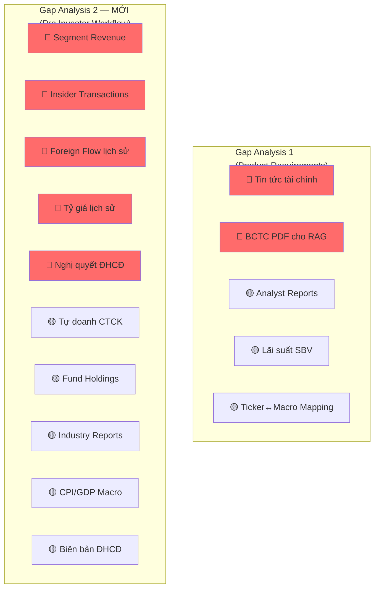

# Data Gap: Workflow Nhà Đầu Tư Chuyên Nghiệp

> Mapping 10 bước phân tích chuyên nghiệp → dữ liệu cần có → vnstock free đã đủ chưa → cần cào thêm gì

---

## Tổng quan nhanh

| Bước | Tên | Vnstock Free | Cần cào thêm |
| :---: | :--- | :---: | :---: |
| 1 | Business Model | ⚠️ Thiếu nhiều | ✅ |
| 2 | Financials (3-5 năm) | ✅ Đủ | ❌ |
| 3 | Valuation | ⚠️ Thiếu 1 phần | ✅ |
| 4 | Growth Story | ❌ Không có | ✅ |
| 5 | Management | ⚠️ Cơ bản | ✅ |
| 6 | Smart Money / Institutional | ⚠️ Thiếu nhiều | ✅ |
| 7 | Timing / Technical | ✅ Đủ | ❌ |
| 8 | Risk Analysis | ❌ Không có | ✅ |
| 9 | Nguồn dữ liệu chuyên sâu | ❌ Không có | ✅ |
| 10 | Checklist | ✅ Logic layer | ❌ |

---

## Chi tiết từng bước

### Bước 1: Business Model — ⚠️ Thiếu nhiều

**Nhà đầu tư cần biết:** FPT kiếm tiền từ đâu? Mảng nào tăng trưởng? Lợi thế cạnh tranh?

| Dữ liệu cần | Vnstock Free? | Chi tiết |
| :--- | :---: | :--- |
| Tên công ty, ngành, lịch sử | ✅ | `Company.overview()` |
| **Doanh thu theo mảng/segment** | ❌ | Cần cào từ BCTC hoặc IR |
| **Lợi nhuận theo mảng** | ❌ | Cần cào từ BCTC thuyết minh |
| **Cơ cấu doanh thu (% mỗi mảng)** | ❌ | Cần cào/tính từ báo cáo |
| Mô tả kinh doanh chính | ⚠️ | `overview().main_business` — rất sơ sài |
| **Lợi thế cạnh tranh (moat)** | ❌ | Cần từ analyst reports hoặc IR |

**🆕 Data mới cần cào:**

| # | Data | Nguồn gợi ý | Format |
| :---: | :--- | :--- | :--- |
| 1.1 | **Segment Revenue Breakdown** | BCTC thuyết minh, Annual Report, IR page (FPT: fpt.com.vn/ir) | Table trong PDF/HTML |
| 1.2 | **Business Description chi tiết** | Annual Report, Company IR page | Text |

---

### Bước 2: Financials (3-5 năm) — ✅ Đã đủ

| Dữ liệu cần | Vnstock Free? | Source |
| :--- | :---: | :--- |
| Doanh thu, lợi nhuận | ✅ | `Finance.income_statement()` |
| Gross margin, Net margin | ✅ | `Finance.ratio()` |
| ROE, ROA | ✅ | `Finance.ratio()` |
| Cash flow | ✅ | `Finance.cash_flow()` |
| Debt/Equity | ✅ | `Finance.ratio()` |
| Balance Sheet | ✅ | `Finance.balance_sheet()` |

> [!TIP]
> Vnstock free cung cấp 46+ chỉ số qua `ratio()`. Financials structured data **đã đủ** cho bước này.
> Tuy nhiên, nếu muốn **5 năm liên tục**, cần verify vnstock trả được data đủ xa.

---

### Bước 3: Valuation — ⚠️ Thiếu 1 phần

| Dữ liệu cần | Vnstock Free? | Chi tiết |
| :--- | :---: | :--- |
| P/E | ✅ | `ratio()` hoặc `trading_stats()` |
| P/B | ✅ | `ratio()` hoặc `trading_stats()` |
| **EV/EBITDA** | ⚠️ | `ratio()` có thể có, cần verify. Nếu không → tự tính từ BS + IS |
| **P/E lịch sử (5 năm)** | ⚠️ | `ratio()` trả theo quý, cần ghép với giá |
| **P/E trung bình ngành** | ❌ | Cần tự tính: lấy ratio tất cả ticker cùng ICB → average |
| **So sánh peer (cùng ngành)** | ❌ | Cần tự build: ICB mapping + ratio per ticker |

**🆕 Data mới cần cào/tính:**

| # | Data | Cách làm |
| :---: | :--- | :--- |
| 3.1 | **Peer Valuation Table** | Tự build: `industries_icb()` → lấy tickers cùng ngành → `ratio()` cho mỗi ticker → tính mean/median |
| 3.2 | **Historical P/E band** | Tự build: `ratio()` theo quý × giá đóng cửa cuối quý |

> [!NOTE]
> 3.1 và 3.2 **không cần cào bên ngoài** — có thể tự tính từ vnstock free data. Nhưng cần **logic pipeline** để aggregate.

---

### Bước 4: Growth Story — ❌ Không có trong vnstock

**Nhà đầu tư cần:** Ngành có đang trend? Pipeline hợp đồng? Future revenue visibility?

| Dữ liệu cần | Vnstock Free? | Chi tiết |
| :--- | :---: | :--- |
| **Industry/sector trend analysis** | ❌ | Cần từ báo cáo ngành, tin tức |
| **Pipeline hợp đồng / backlog** | ❌ | Cần từ earnings call, IR, ĐHCĐ |
| **Guidance / kế hoạch kinh doanh** | ❌ | Cần từ nghị quyết ĐHCĐ, IR |
| Revenue growth rate (lịch sử) | ✅ | Tính từ `income_statement()` |

**🆕 Data mới cần cào:**

| # | Data | Nguồn | Ưu tiên |
| :---: | :--- | :--- | :---: |
| 4.1 | **Nghị quyết ĐHCĐ** (kế hoạch KD năm) | Website công ty IR, CafeF events | 🔴 |
| 4.2 | **Earnings call / KQKD presentation** | IR page, YouTube | 🟡 |
| 4.3 | **Báo cáo ngành** (industry reports) | SSI Research, VNDirect Research | 🟡 |

---

### Bước 5: Management — ⚠️ Cơ bản

| Dữ liệu cần | Vnstock Free? | Chi tiết |
| :--- | :---: | :--- |
| Danh sách lãnh đạo | ✅ | `Company.officers()` → name, position |
| Tỷ lệ sở hữu lãnh đạo | ✅ | `Company.officers()` → ownership_pct |
| **Track record (thành tích)** | ❌ | Cần từ news, IR, annual report |
| **Insider transactions** (mua/bán nội bộ) | ❌ | Cần cào từ HOSE/HNX thông báo giao dịch nội bộ |
| **Lịch sử thay đổi ban lãnh đạo** | ❌ | Cần từ events hoặc news |

**🆕 Data mới cần cào:**

| # | Data | Nguồn | Ưu tiên |
| :---: | :--- | :--- | :---: |
| 5.1 | **Insider transactions** (giao dịch nội bộ) | HOSE (hose.vn), CafeF mục "giao dịch nội bộ" | 🔴 |
| 5.2 | Thay đổi nhân sự cấp cao | News crawl + filter | 🟢 |

---

### Bước 6: Smart Money / Institutional — ⚠️ Thiếu nhiều

| Dữ liệu cần | Vnstock Free? | Chi tiết |
| :--- | :---: | :--- |
| Foreign net buy/sell (hiện tại) | ⚠️ | `price_board()` VCI có `foreign_buy` nhưng chỉ realtime, không lịch sử |
| **Foreign flow lịch sử** | ❌ | Cần cào time-series |
| **Institutional ownership %** | ❌ | Cần từ shareholders detail |
| **Danh sách quỹ đang nắm giữ** | ❌ | Cần từ báo cáo quỹ hoặc HOSE |
| Volume bất thường | ⚠️ | Tính từ OHLCV (volume spike detection) — tự build |
| Cổ đông lớn | ✅ | `Company.shareholders()` |

**🆕 Data mới cần cào:**

| # | Data | Nguồn | Ưu tiên |
| :---: | :--- | :--- | :---: |
| 6.1 | **Foreign flow lịch sử** (net buy/sell daily) | CafeF, Vietstock, HOSE | 🔴 |
| 6.2 | **Proprietary trading flow** (tự doanh CTCK) | CafeF mục "giao dịch tự doanh" | 🟡 |
| 6.3 | **Fund holdings** (quỹ nào đang giữ) | Báo cáo NAV quỹ, Dragon Capital, VinaCapital... | 🟡 |

---

### Bước 7: Timing / Technical — ✅ Đã đủ

| Dữ liệu cần | Vnstock Free? |
| :--- | :---: |
| OHLCV (trend analysis) | ✅ `Quote.history()` |
| Volume | ✅ |
| SMA, RSI, MACD | ✅ Tính từ OHLCV |
| Support/Resistance | ✅ Tính từ OHLCV |

> Không cần cào thêm. Logic tính indicator nằm ở code layer.

---

### Bước 8: Risk Analysis — ❌ Cần data macro

| Dữ liệu cần | Vnstock Free? | Chi tiết |
| :--- | :---: | :--- |
| **Rủi ro ngành** (IT suy giảm) | ❌ | Cần industry reports + news |
| **Chi phí nhân lực** | ❌ | Cần từ BCTC thuyết minh (chi phí lương) |
| **Tỷ giá USD/VND lịch sử** | ⚠️ | `Misc` có VCB rate hiện tại, không có lịch sử |
| **Lãi suất** | ❌ | Đã note ở gap analysis trước |
| **CPI / lạm phát** | ❌ | Cần từ GSO hoặc macro data |

**🆕 Data mới cần cào:**

| # | Data | Nguồn | Ưu tiên |
| :---: | :--- | :--- | :---: |
| 8.1 | **Tỷ giá USD/VND lịch sử** | SBV, VCB, hoặc FMP connector | 🔴 |
| 8.2 | **CPI / Lạm phát VN** | GSO (gso.gov.vn), World Bank API | 🟡 |
| 8.3 | **GDP growth VN** | GSO, World Bank API | 🟡 |

---

### Bước 9: Nguồn dữ liệu chuyên sâu — ❌ Cần cào

| Nguồn pro dùng | Vnstock Free? | Thay thế |
| :--- | :---: | :--- |
| **IR page công ty** (FPT IR, VCB IR...) | ❌ | Cào HTML/PDF từ investor relations page |
| **Báo cáo CTCK** (SSI, VND, VCBS) | ❌ | Đã note ở gap analysis trước |
| **Earnings call transcript** | ❌ | Cào từ IR page hoặc YouTube transcript |
| **Biên bản ĐHCĐ** | ❌ | Cào từ HOSE/HNX hoặc IR page |
| Tin tức vĩ mô | ❌ | Đã note ở gap analysis trước |

**🆕 Data mới cần cào:**

| # | Data | Nguồn | Ưu tiên |
| :---: | :--- | :--- | :---: |
| 9.1 | **IR pages top ~50 tickers** | fpt.com.vn/ir, vcb.com.vn/ir, etc. | 🟡 |
| 9.2 | **Biên bản ĐHCĐ** | HOSE, CafeF events | 🟡 |
| 9.3 | **Earnings call transcripts** | IR pages, YouTube auto-transcript | 🟢 |

---

### Bước 10: Checklist — ✅ Logic layer

Không cần data mới. Đây là orchestration logic trong Agent system.

---

## 📋 Tổng hợp: Data mới cần cào (DELTA so với gap analysis trước)

Đây là những data **chưa có** trong [gap analysis trước](file:///home/quangnhvn34/.gemini/antigravity/brain/b575c435-6ab8-4840-9be9-3bb77d79ef04/artifacts/data_gap_analysis.md) mà workflow pro investor yêu cầu thêm:

### 🔴 Ưu tiên cao

| # | Data | Bước | Nguồn cào | Ghi chú |
| :---: | :--- | :---: | :--- | :--- |
| **D1** | Segment Revenue Breakdown | 1 | BCTC thuyết minh, Annual Report | Hiểu business model |
| **D2** | Insider Transactions (giao dịch nội bộ) | 5 | HOSE, CafeF | Tín hiệu quan trọng |
| **D3** | Foreign Flow lịch sử (daily net buy/sell) | 6 | CafeF, Vietstock | Smart money tracking |
| **D4** | Tỷ giá USD/VND lịch sử | 8 | SBV, FMP | Risk analysis |
| **D5** | Nghị quyết ĐHCĐ (kế hoạch KD) | 4 | CafeF events, IR page | Growth story + guidance |

### 🟡 Ưu tiên trung bình

| # | Data | Bước | Nguồn cào |
| :---: | :--- | :---: | :--- |
| **D6** | Proprietary trading flow (tự doanh) | 6 | CafeF |
| **D7** | Fund holdings (quỹ nào giữ) | 6 | Báo cáo NAV quỹ |
| **D8** | Báo cáo ngành (industry reports) | 4 | SSI, VNDirect Research |
| **D9** | CPI / Lạm phát / GDP VN | 8 | GSO, World Bank API |
| **D10** | Biên bản ĐHCĐ | 9 | HOSE, CafeF |

### 🟢 Ưu tiên thấp

| # | Data | Bước | Nguồn cào |
| :---: | :--- | :---: | :--- |
| **D11** | Earnings call transcripts | 9 | IR pages, YouTube |
| **D12** | IR page content (top 50 tickers) | 9 | Company websites |
| **D13** | Thay đổi nhân sự cấp cao | 5 | News filter |

### Không cần cào (tự tính từ vnstock free)

| Data | Cách làm |
| :--- | :--- |
| Peer Valuation (P/E ngành) | `industries_icb()` + `ratio()` per ticker → aggregate |
| Historical P/E Band | `ratio()` × giá cuối quý |
| Volume anomaly detection | OHLCV → statistical detection |
| Revenue growth rate | `income_statement()` → YoY calculation |

---

## So sánh: Gap Analysis trước vs. Bây giờ

**Tổng cộng data cần cào cho hệ thống hoàn chỉnh: 5 (cũ) + 13 (mới) = 18 nguồn data.**
